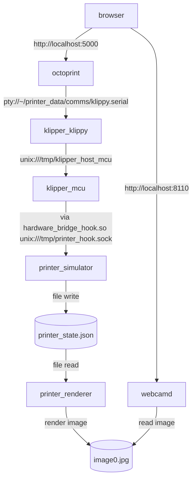

[](https://github.com/mainsail-crew/virtual-klipper-printer/blob/master/LICENSE 'License')

---
# Virtual-Klipper-Printer

This project provides a Docker container that simulates a Klipper 3D printer,
allowing you to test and develop Klipper Components without needing a physical
printer. It also includes OctoPrint, a dummy webcam, and a pre-configured
Klipper instance.

This branch replaces Moonraker (and Mainsail) with OctoPrint.

I forked this to fix some errors I encountered and to add some things for the workshop:

* In extruder configs, set min extrude temperatur to 0. Was getting some errors otherwise.
* In `linux.config` set `CONFIG_CLOCK_FREQ=8000000` instead of `CONFIG_CLOCK_FREQ=50000000`. Was also getting errors otherwise, seems like this has alleviated that problem.
* Replaced Moonraker (and Mainsail) with OctoPrint.

However: the OctoPrint MQTT plugin relies on [events in OctoPrint](https://docs.octoprint.org/en/main/events/index.html), so far I was using command M154 to set up automated PositionUpdate events, but klipper doesn't support it (https://www.klipper3d.org/G-Codes.html), so I'm not quite sure how I can get the position out of the klipper printer. M114 is supported, but that means I'd have to continuously send that over? Could maybe also be inserted it in the generated gcode, then you'd get a position update after every mode? Anyway, feels a bit hacky, I might figure that out if I have some more time, but doesn't really feel necessary.

## Setup for workshop

Build the docker image:

      docker compose -f docker-compose.build.yml -f docker-compose.yml build

(Optional) To quickly after building:

      docker compose -f docker-compose.build.yml -f docker-compose.yml up -d

The in OctoPrint itself, set up the serial connection to the klippy host: https://www.klipper3d.org/OctoPrint.html

Note: I've found that `~/printer_data/comms/klippy.serial` as specified in that guide doesn't resolve correctly. Writing the absolute path does: `/home/printer/printer_data/comms/klippy.serial`

---

## Setup Instructions
There are two ways to set up the Virtual-Klipper-Printer. You can use the
pre-built Docker image from GitHub Container Registry or build the image
yourself using the provided Dockerfile.

### Prerequisites
* Docker and Docker Compose installed on your system (see
  [Docker Installation Guide](https://docs.docker.com/get-docker/))
* A terminal or command line interface to run Docker commands

### Option 1: Using Pre-built Docker Image (Recommended)
The recommended way to set up the Virtual-Klipper-Printer is to use the
pre-built Docker image available on GitHub Container Registry. This method is
simpler and faster, as it does not require building the image yourself.

If you want the OctoPrint-based setup in this repository, build from the local
Dockerfile instead of using the published image.

1. Clone this repository
2. Open a terminal in the cloned folder
3. Run `docker compose up -d` to build the docker image and start the container
   in detached mode

### Option 2: Building the Docker Image Yourself
This option allows you to build the Docker image from the provided Dockerfile.
This is useful if you want to customize the image or if you prefer to build it
yourself. It's possible to change the Klipper Repo URL with this method. 

1. Clone this repository
2. Copy `docker-compose.build.yml` to `docker-compose.override.yml`.
3. Edit the `docker-compose.override.yml` file to change the `KLIPPER_REPO_URL`
   variable to your desired Klipper repository URL (default is the official
   Klipper repository)
4. Open a terminal in the cloned folder
5. Run `docker compose up -d --build` to build the docker image and start the
   container in detached mode

Alternatively you can execute `docker-compose -f docker-compose.build.yml -f docker-compose.yml up -d --build`
---

## Configure a Dummy-Webcam
To configure a dummy-webcam, use the following URLs:
   * Stream: `http://localhost:8110/?action=stream`
   * Snapshot: `http://localhost:8110/?action=snapshot`

## Access OctoPrint
Open OctoPrint at `http://localhost:5000`.
During setup, use `/home/printer/printer_data/comms/klippy.serial` as the
printer serial port.

---

## Common Docker commands
* Get all container IDs and status: `docker ps -a`
* Get only the ID of running containers: `docker ps`
* Access a containers shell: `docker exec -it printer bash`
* Start/Restart/Stop a container: `docker container start/restart/stop printer`
* Remove a container: `docker container rm printer`

## Using supervisorctl

1. Access the containers shell: `docker exec -it printer bash`
2. Use `supervisorctl status` to inspect service status
3. Start/restart/stop all services `supervisorctl start/restart/stop all`
4. Start/restart/stop a specific service `supervisorctl start/restart/stop <service_name>`

## Architecture

Inside the Docker container multiple services are started and controlled via supervisor.

- `klipper_klippy`: This is the main Klipper service that runs the Klipper firmware and handles communication with the printer.
- `klipper_mcu`: This service simulates the microcontroller unit (MCU).
- `printer_simulator`: This service simulates the printer hardware, providing fake responses to Klipper's commands.
- `octoprint`: This is the OctoPrint service that provides the web UI and sends gcode over Klippy's serial PTY.
- `webcamd`: This service simulates a webcam stream for Klipper.

The klipper_mcu is supposed to be running on a dedicated Microcontroller or SoC. The Klipper MCU code is compiled with Build-Target "Linux".  
Reading Sensor Outputs and controlling GPIO Pins etc. is done via Syscalls to specific paths/devices in the linux file tree.
For emulation of a working printer those Syscalls are intercepted (see `printer_simulator/hardware_bridge_hook.c`) and redirected to a Python-Service.  
The  Python-Service simulates a 3D Printer Hardware including thermals and the movement system.  
From the current system state an Image Stream is derived



## Performance considerations

It is expected that the klipper_mcu service is running on dedicated hardware to ensure realtime accuracy of the printer hardware.
Communication between klipper_mcu and the printer_simulator leads to latency which can trip timing safeguards in klipper.
The printer_simulator needs to execute as fast as possible to avoid this.

## Code Quality (printer_simulator)

The `printer_simulator` subproject includes:

- `ruff` for linting and formatting
- `mypy` for static type checks
- `pre-commit` for local git hooks

### Setup

```bash
cd printer_simulator
python3 -m venv .venv
source .venv/bin/activate
python -m pip install --upgrade pip
pip install -r requirements-dev.txt
cd ..
pre-commit install
```

### Manual checks

```bash
cd printer_simulator
source .venv/bin/activate
make lint
make format
make typecheck
```